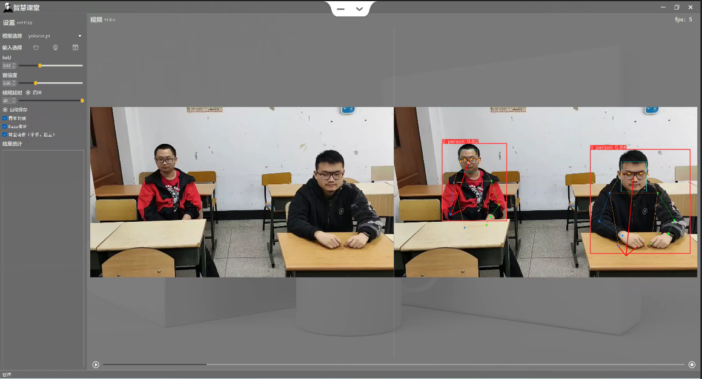
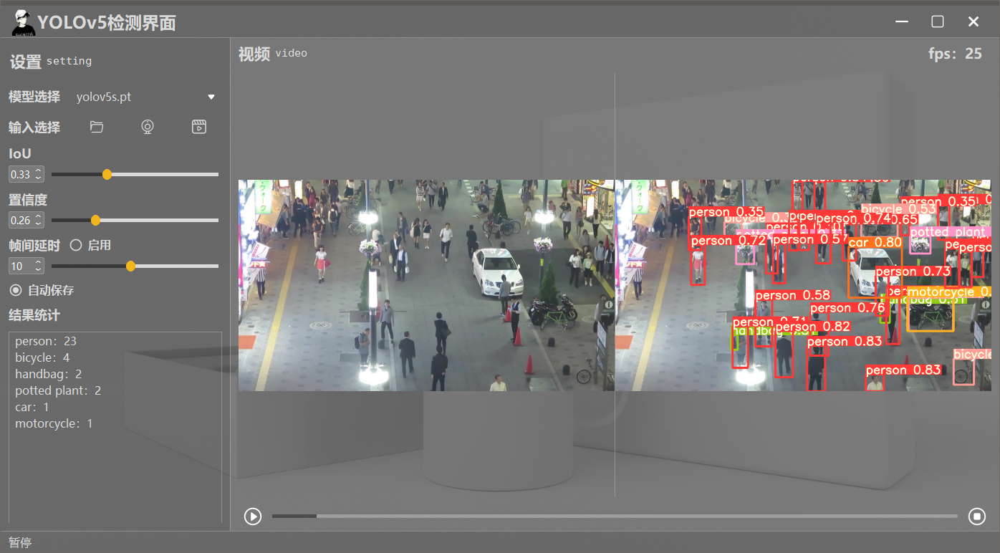

<!--
 * @Descripttion: 
 * @version: 
 * @Author: LiQiang
 * @Date: 2022-09-29 19:15:40
 * @LastEditTime: 2022-09-29 20:26:07
-->
# SH-human
目标检测；多目标跟踪；多人姿态估计；

## 简介
基于[Yolov5_StrongSORT_OSNet](https://github.com/mikel-brostrom/Yolov5_StrongSORT_OSNet)的高效开发框架，主要用于**Human**，支持目标检测、多人跟踪、多人姿态估计等。[Yolov5_StrongSORT_OSNet 说明](docs/README_YoloV5%2BStrongSORT.md)

## 环境
- Python 3.8
- torch 1.10.0+cu102
- [其他环境environment.yml](docs/environment.yml)

## 安装
```
git clone https://github.com/ShanHai-AI/SH-human.git

cd SH-human

pip install -r requirements.txt

pip install openmim

mim install mmcv-full

cd mmpose

pip3 install -e .
```
【可选安装】C加速reid
```
cd SH-human/strong_sort/deep/reid/torchreid/metrics/rank_cylib
python setup.py build_ext --inplace
```
## Tensort 加速
```
tensorrt 安装:

pip install tensorrt
pip install nvidia-pyindex
pip install nvidia-tensorrt

模型导出：
 - 检测模型导出:
 
  cd yolov5
  python export.py --weights crowdhuman_yolov5m.pt --include engine --device 0
  
  参数说明：
  --weights ：要转的模型权重，复制到yolov5目录下即可
  --include ：要转换的模型格式，engine代表tensorrt格式
  
- 跟踪模型导出：

  python reid_export.py --include onnx engine --device 0 --batch-size <max_num_expected_objects> --dynamic
  
  参数说明：max_num_expected_objects为最大跟踪目标个数，可设置为100
  参考：https://github.com/mikel-brostrom/Yolov5_StrongSORT_OSNet/issues/581
```
## 支持算法

- [x] 目标检测
- [x] 多目标跟踪
- [x] 多人姿态估计
- [x] 人脸检测YOLO5Face
- [ ] 多人GAZE估计
- [ ] 打架识别
- [ ] 抽烟检测
- [x] 口罩识别
- [ ] 打电话识别
- [x] 起立、举手
- [x] 跌倒检测

## 文件说明
| 文件名称                | 说明                                                |
| ----------------------- | -------------------------------------------------------- |
| hook | 钩子目录，用于存放一些算法实现文件          |
| [mmpose](https://github.com/open-mmlab/mmpose)     | 用于人体关键点估计 |
| [yolov5](https://github.com/ultralytics/yolov5)     | 目标检测YOLOv5 |
|strong_sort     | 跟踪算法 |
|stgcn     | 骨架行为识别算法 |
|weights     | 模型权重 |
|testvideo     | 测试视频 |

## 权重下载
|文件名|说明|下载链接|
| ----------------------- | -------------------------------------------------------- | -------------------------------------------------------- |
|crowdhuman_yolov5m.pt|拥挤人群person、head检测|链接：https://pan.baidu.com/s/1SKhgLaqolnBZU9iDmjOUOg?pwd=rgtv 提取码：rgtv


## 界面



## 快速开始
### [口罩识别](docs/%E5%8F%A3%E7%BD%A9%E8%AF%86%E5%88%AB.md)
### [多人姿态估计](docs/%E5%A4%9A%E4%BA%BA%E5%A7%BF%E6%80%81%E4%BC%B0%E8%AE%A1.md)
### [人脸检测YOLO5Face](https://github.com/deepcam-cn/yolov5-face)


## 参考
https://github.com/ShanHai-AI/SH-human
https://github.com/Javacr/PyQt5-YOLOv5
